## Infra Process Diagram


In this solution, I have created a simple app consisting of a Go backend service and a Node.js backend service. I have set up a CI/CD pipeline using Jenkins and FluxCD to automate the build, containerization, and deployment processes. The services can be accessed from the public internet using a DNS domain (required binding host).


# Code Explanation

## Go Backend Service

link : https://github.com/MuhRizkyPerdana/war-repo/tree/goapp

I have created a basic Go backend service with the following structure:

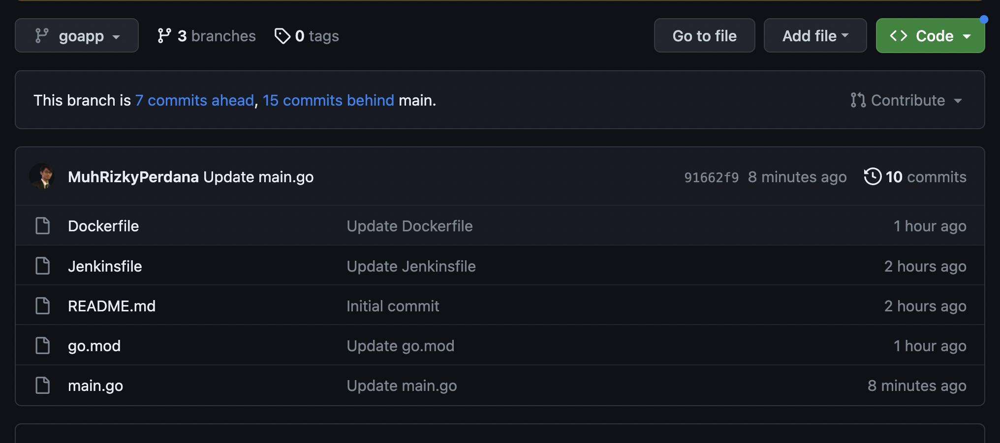

the main.go file contains the Go code for a simple HTTP server. The Dockerfile is used to build the container image for the Go service.

## Node.js Backend Service

link : https://github.com/MuhRizkyPerdana/war-repo/tree/nodejs-app

I have also created a basic Node.js backend service with the following structure:

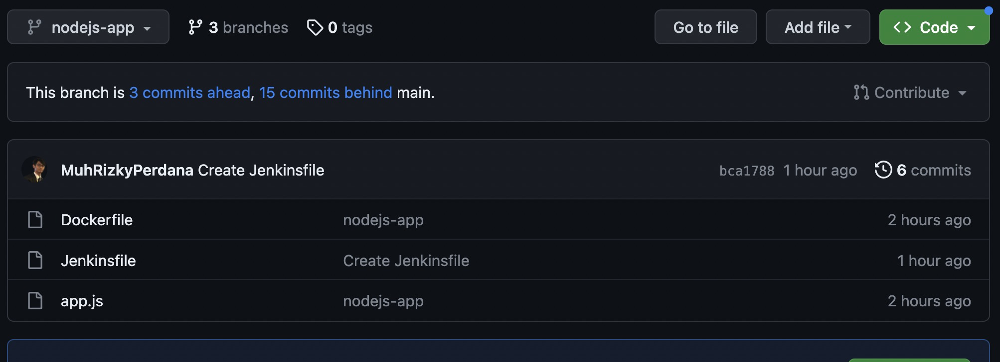

The index.js file contains the Node.js code for a simple Express server. The Dockerfile is used to build the container image for the Node.js service.


and Both The Jenkinsfile defines the CI/CD pipeline stages and steps.

## CI Pipeline Configuration with Jenkins
The CI pipeline is configured using Jenkins and consists of the following stages:

- Build and Test: The Go and Node.js backend services are built using their respective build scripts or commands. Optional tests can also be executed.

- Build Container Image: Docker is used to build and tag the container images for the Go and Node.js services based on their Dockerfiles.

- Container Image Push: The container images can be pushed to a container registry (e.g., Docker Hub or a private registry) for storage and accessibility.

- When Activity Done Will Be Give Information to Media Like Discord or Etc.

Pipeline Jenkinsfile

```bash
pipeline {
    agent {
        label 'docker'
    }
    environment {
        GCP_SERVICE_ACCOUNT = credentials('gcp_service_account_storage')
        DISCORD = credentials('discord')
    }
    parameters {
        string(name: 'TAG', defaultValue: 'Beta', description: 'Tag for your Image')
    }
    stages {
        stage('Build') {
            steps {
                echo 'build App'
                sh 'docker build -t gcr.io/studi-devops-370205/nodejs-app:${TAG} .'
            }
        }
        stage('Push To GCR') {
            steps {
                echo 'Push Image'
                sh 'cat "$GCP_SERVICE_ACCOUNT" | docker login -u _json_key --password-stdin https://gcr.io'
                sh 'docker push gcr.io/studi-devops-370205/nodejs-app:${TAG}'
            }
            post {
                failure {
                    echo "post failure"
                    discordSend description: "Jenkins Build And Push Image nodejs-app:${TAG}", footer: "post failure", link: env.BUILD_URL, result: currentBuild.currentResult, title: JOB_NAME, webhookURL: "$DISCORD"
                }
                success {
                    echo "post success"
                    discordSend description: "Jenkins Build And Push Image nodejs-app:${TAG}", footer: "post success", link: env.BUILD_URL, result: currentBuild.currentResult, title: JOB_NAME, webhookURL: "$DISCORD"
                }
                aborted {
                    echo "post aborted"
                    discordSend description: "Jenkins Build And Push Image nodejs-app:${TAG}", footer: "post aborted", link: env.BUILD_URL, result: currentBuild.currentResult, title: JOB_NAME, webhookURL: "$DISCORD"
                }
            }
        }
      
    }
}
```

## CD Deployment Configuration with FluxCD
The CD deployment is configured using FluxCD and can be modified to deploy specific tags or versions of the container images. Follow these steps to manually specify the image tag for deployment:

- Image Update Detection: By default, FluxCD continuously monitors the container registry for new versions of the deployed container images. To disable the automated image detection, you can modify the FluxCD configuration.

- Manifest Synchronization: Instead of relying on image detection, you can manually update the Kubernetes manifests with the desired image tag or version. Modify the Kubernetes deployment manifests for the services in your repository and specify the desired image tag. For example, you can update the image field in the deployment manifest to use a specific tag or version.

- Manual Deployment: Once the Kubernetes manifests are updated with the desired image tag, FluxCD will synchronize the manifests and deploy the specified tag to the Kubernetes cluster. To trigger the deployment, you can use FluxCD's Change Tag By Repo.

By modifying the FluxCD configuration and updating the Kubernetes deployment manifests, you have more control over the specific tag or version of the container image that is deployed to the Kubernetes cluster.


# Running the CI/CD 

## Running the CI Pipeline in Jenkins
To run the CI pipeline in Jenkins and build the image while allowing you to tag it using a text parameter, follow these steps:

Set up Jenkins and ensure it is properly configured to use the Jenkinsfile provided in this repository.

Create a new Jenkins job for the CI pipeline:

Navigate to Jenkins and click on "New Item" to create a new job.
Enter a name for the job (e.g., "G").
Select "Pipeline" as the job type and click "OK".

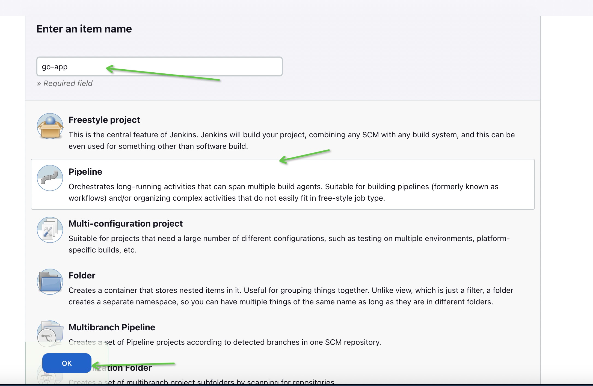

Configure the Jenkins job:

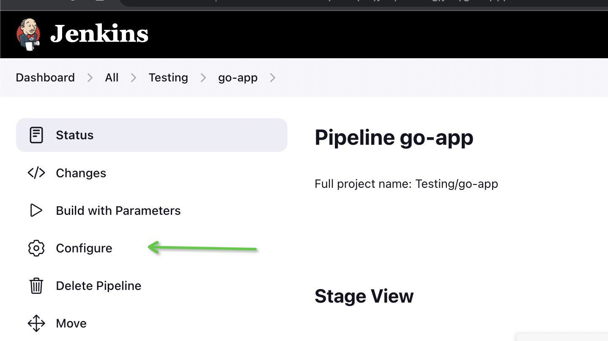

In the job configuration, under the "Pipeline" section, select "Pipeline script from SCM" as the definition.
Specify the repository URL where this repository is hosted.
Optionally, you can specify a branch or tag to build.
Save the configuration.
Customize the image tag using a text parameter:

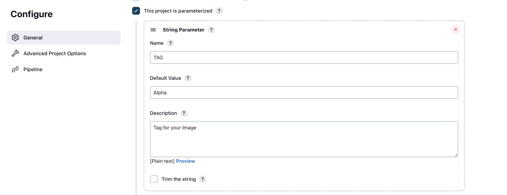

In the Jenkins job configuration, click on "This project is parameterized" to add a parameter.
Select "Text Parameter" and give it a name (e.g., "IMAGE_TAG").
Save the configuration.


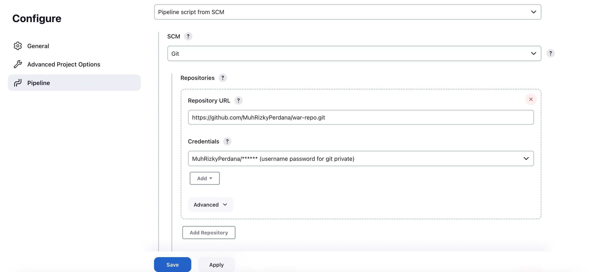


Modify the Jenkinsfile:

example using this file 

link : https://github.com/MuhRizkyPerdana/war-repo/blob/goapp/Jenkinsfile

Open the Jenkinsfile in this repository and locate the stage where the image is built.

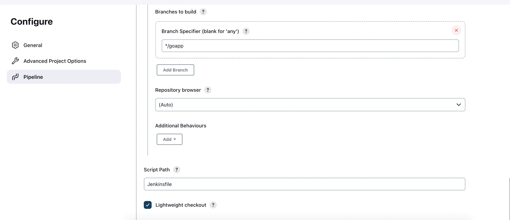

Modify the Docker build command to include the desired image tag. You can use the Jenkins text parameter as the tag value. For example:

bash
Copy code
docker build -t gcr.io/<project_id>/goapp:${params.IMAGE_TAG} .
Run the Jenkins job:

Go to the Jenkins dashboard and locate the newly created job.
Click on "Build with Parameters" to start a new build.
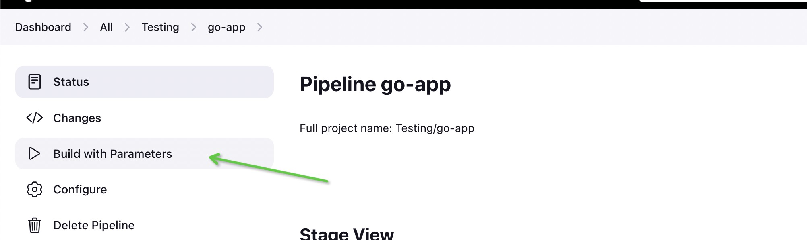

Enter the desired image tag value in the parameter field (e.g., "Alpha" or "1.0.0").
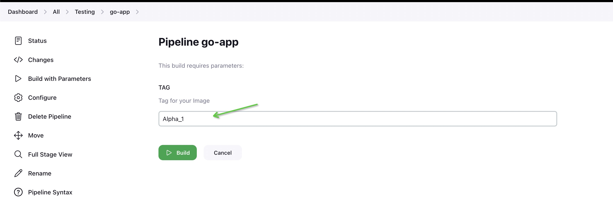

Start the build.

Jenkins will execute the defined stages in the Jenkinsfile, including building the services, creating the container image, and tagging it with the specified image tag.

After the build is successful, the image will be pushed to the Google Cloud Registry with the specified tag.

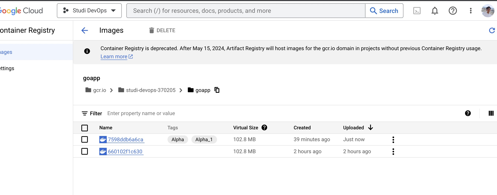

after done , Jenkins will be Inform to media, example discord

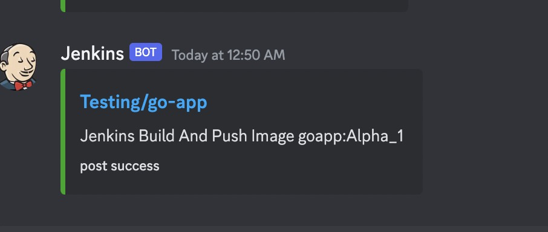


## Running the CD using Flux CD

Install FluxCD: Start by installing FluxCD on your Kubernetes cluster. You can use the official installation guide provided by FluxCD to install the necessary components, such as the Flux operator and Helm release. Make sure you have the appropriate permissions and access to the cluster.

link : https://fluxcd.io/flux/installation/

Configure FluxCD: Once FluxCD is installed, you need to configure it to monitor your repository and synchronize deployments. Create a Flux configuration file (e.g., flux.yaml) that specifies the repository URL, branch or tag to watch, and other settings. Include the necessary information to authenticate with the repository, such as SSH keys or personal access tokens.

- Create Repo example : war-repo

```
Untuk setup fluxcd

1. github personal token
> go to setting
> choose developer setting
> personal access token
> token (classic)

https://github.com/settings/tokens

> Choose Only repo
> create token
> copy Result token

result token : blalalalal

2. Create Repository github (example =  war-repo)
3. Bootstrap Fluxcd
    notes: make sure already install flux
    example command mac: brew install flux/tap/flux

https://fluxcd.io/flux/installation/

4. - export GITHUB_TOKEN= {result token}
   - echo $GITHUB_TOKEN

TWO Option Bootstrap flux by SSH or Token

a . Bootstrap fluxcd SSH

flux bootstrap github \
  --owner=MuhRizkyPerdana \
  --repository=war-repo \
  --path=clusters/war-staging \
  --personal


b. Bootstrap fluxcd Token


flux bootstrap github \
  --components-extra=image-reflector-controller,image-automation-controller \
  --owner=MuhRizkyPerdana \
  --repository=war-repo \
  --branch=main \
  --path=clusters/war-staging \
  --read-write-key \
  --personal

```

After That Apply

- Apply Flux Configuration: Apply the Flux configuration to the cluster using the kubectl apply command. This will create the Flux custom resources and initiate the synchronization process. FluxCD will start monitoring the repository and apply changes to the cluster based on the defined rules.

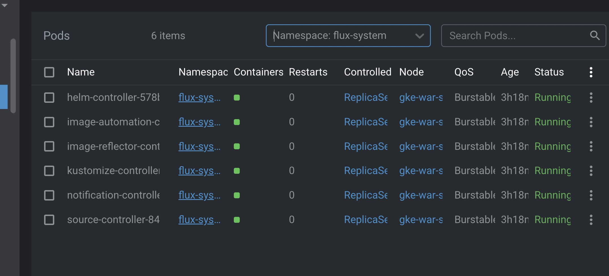

- Update Deployment Manifests: In your repository, update the deployment manifests for the services you want to deploy using FluxCD. Modify the image tag or version to the desired value. Ensure that the updated tag or version matches an available image in your container registry.

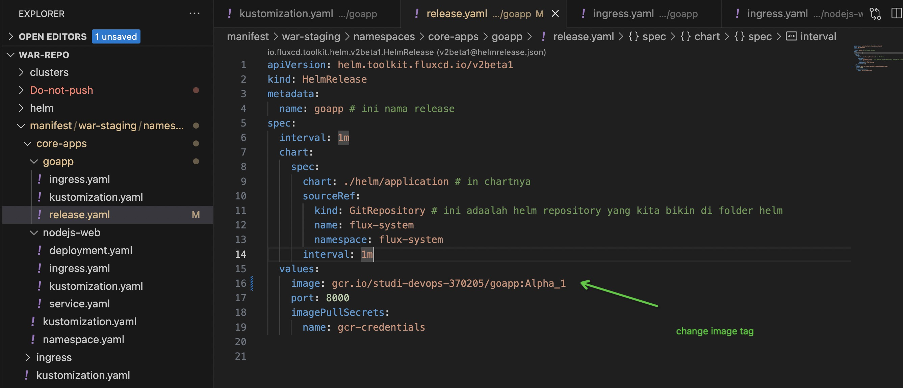

- Commit and Push Changes: Commit the changes to the deployment manifests in your repository and push them. This will trigger FluxCD to detect the changes in the repository.

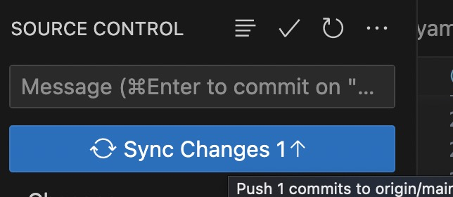

- Synchronization and Deployment: FluxCD will automatically detect the changes and start the synchronization process. It will compare the updated manifests with the current state in the cluster and apply the necessary changes. The new container image with the updated tag or version will be deployed to the cluster.

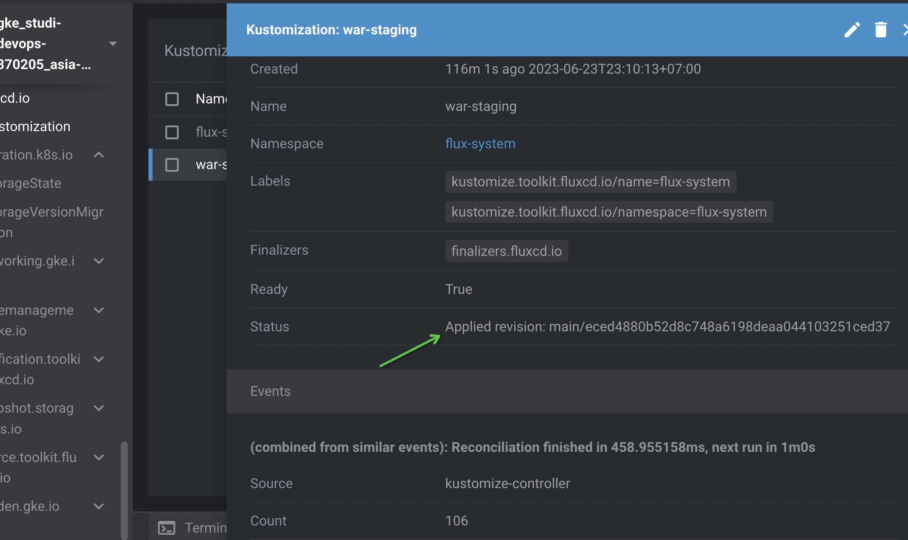


- Monitor and Verify: Monitor the FluxCD logs and the cluster to ensure the deployment is successful. You can use tools like kubectl or Kubernetes dashboard to check the status of the deployed services.

- By following these steps, you can set up and run FluxCD for continuous deployment. FluxCD will automatically detect changes in your repository and deploy the updated container images to the Kubernetes cluster.

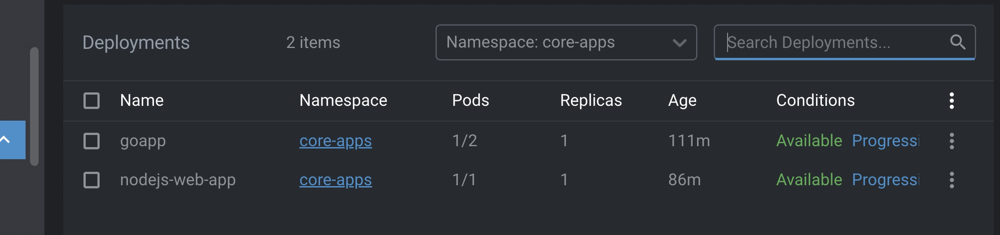


# Result Important

Full Code fluxcd : https://github.com/MuhRizkyPerdana/war-repo/tree/main

## What I am Create FluxCD :

### Connect Flux to Manifest

https://github.com/MuhRizkyPerdana/war-repo/blob/main/clusters/war-staging/common.yaml

### Namespaces :

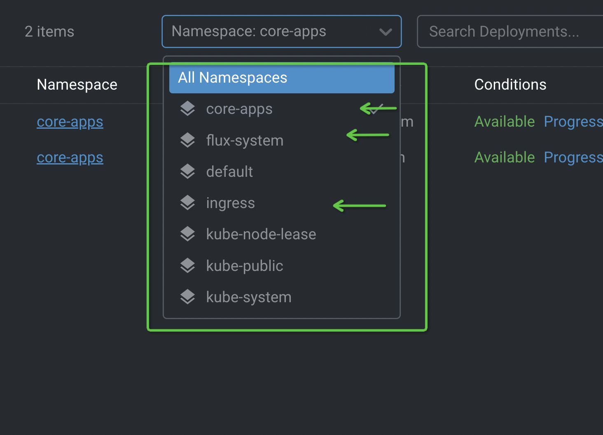

detail repo : 

- https://github.com/MuhRizkyPerdana/war-repo/blob/main/manifest/war-staging/namespaces/core-apps/namespace.yaml
- https://github.com/MuhRizkyPerdana/war-repo/blob/main/manifest/war-staging/namespaces/ingress/namespace.yaml

### Ingress nginx

Using Helm Repository: https://github.com/MuhRizkyPerdana/war-repo/tree/main/helm/ingress-nginx

Service : https://github.com/MuhRizkyPerdana/war-repo/tree/main/manifest/war-staging/namespaces/ingress/ingress-nginx

## Goapp 

I am create helm

helm git repository: https://github.com/MuhRizkyPerdana/war-repo/tree/main/helm

Service : https://github.com/MuhRizkyPerdana/war-repo/tree/main/manifest/war-staging/namespaces/core-apps/goapp


## Node js web app

using only kustomize

service : https://github.com/MuhRizkyPerdana/war-repo/tree/main/manifest/war-staging/namespaces/core-apps/nodejs-web


# Want to Cek Service

### Jenkins

link : http://34.101.48.71:8080/view/all/job/Testing
user :  testing
password : testing123


### Service Access

#### Goapp

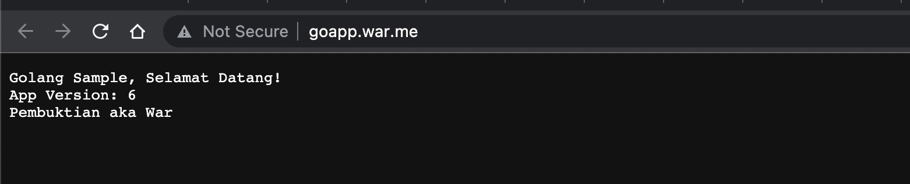

binding host this ip and domain : 34.124.144.62 goapp.war.me

#### Nodejs-web-app

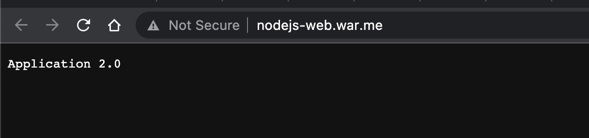

binding host this ip and domain : 34.124.144.62 nodejs-web.war.me

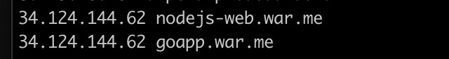


Thank you, I Hope you understand


